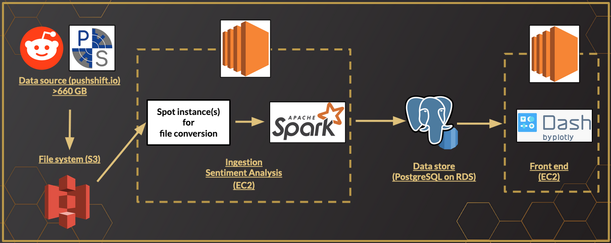
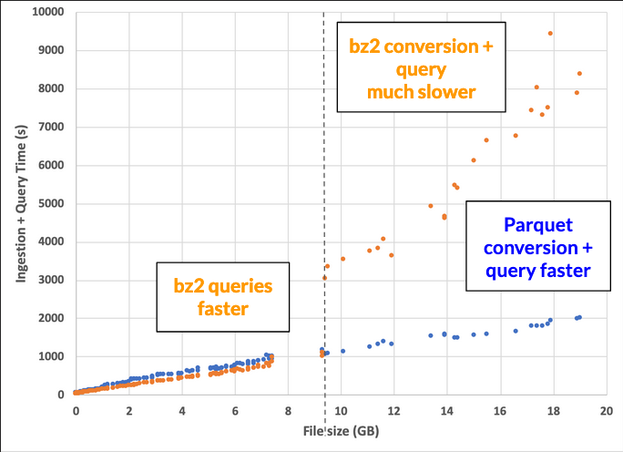
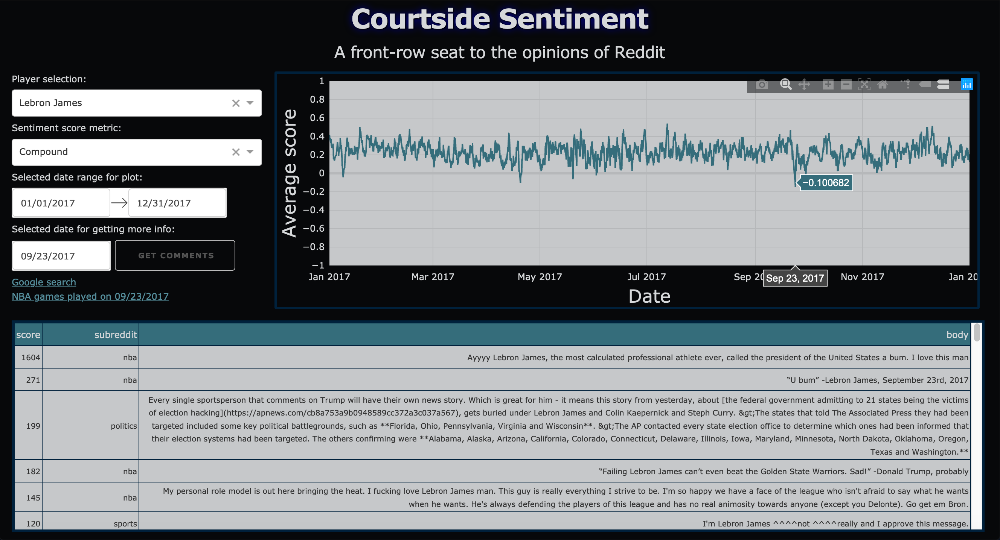

# Courtside Sentiment
A front-row seat to the opinions of Reddit!

## Table of Contents
1. [Project Idea](README.md#project-idea)
1. [Tech Stack](README.md#tech-stack)
1. [Engineering Challenge](README.md#engineering-challenge)
1. [Minimum Viable Product](README.md#minimum-viable-product)
1. [Stretch Goals](README.md#stretch-goals)

## Project idea
Courtside Sentiment is a web application designed for the PR representative of a particular person of people, that allows them to investigate how the perception of their client changes over time according to Reddit comments.  If a client is interested in selling a new product, the release date can have a significant impact on overall sales. 

Much of the decision-making process can be done by looking at previous sales data of similar products.  For example, an NBA player will probably sell more jerseys and other products for die-hard fans around the start of the postseason championships, but around the holidays they might be more likely to sell novelty items like pet outfits to casual fans.

There may occasionally be instances in which sales of some or many products increase or decrease without any apparent cause.  It could be due to a discrete event in the news unrelated to the time of year or athletic performance, like a public statement on Twitter about current events. CourtsideSentiment helps the user identify these discrete events by looking at Reddit comment data. Combining CourtsideSentiment with sales data will then help the user advise their client on whether such discrete events are helpful or harmful to their brand, and use that information to boost sales and visibility during a product release.

## Tech stack
The tech stack for this project is shown below. The data source for this project is over 660 GB of Reddit comment dated hosted by [pushshift](https://files.pushshift.io/reddit/comments/) in compressed JSON format.  There's one data file per month, compressed in `.bz2`, `.xz`, or `.zst` format. The files are converted to compressed `.parquet` format (see [here](https://github.com/jnarkis/CourtsideSentiment/tree/master/file_conversion) for more info), and stored in an Amazon S3 bucket along with the raw data files. For each comment file, the comments are queried for the person of interest (popular NBA players are used for the MVP), and sentiment analysis is performed on them using the [VADER](https://github.com/cjhutto/vaderSentiment) package.  This is done with distributed computing using a Spark cluster of 4 workers using [AWS EC2](https://aws.amazon.com/ec2/) instances (m4.large). The results are saved to a PostgreSQL database hosted by [AWS RDS](https://aws.amazon.com/rds/), which is then queried by the front end using [Dash](https://dash.plot.ly/).

## Engineering challenge
The pipeline can be thought of as one large batch job broken down into smaller pieces, so the engineering challenges will be in identifying and eliminating bottlenecks.  This occurred in two places: first, in ingesting the data, and second: in querying the data.  

While all of the raw data files are in compressed JSON format, only the `.bz2` files can be easily read into PySpark. The other file formats had to be converted from `.xz` and `.zst` into a more useable format. The first approach was to convert all these files into `.bz2` format, which in total took about 24 hours on a single c5d_2xlarge AWS instance. A spot instance was used to save money on a computationally-intensive task that only needed to be completed once per file.

Querying the data in compressed JSON format (bz2) worked well for the smaller files, but for larger files it became prohibitively expensive timewise. The solution was to convert all the data to compressed `.parquet` format, which decreased querying time by a factor of 10 due to the columnar file format.  This resulted in significant time savings for the larger `.xz` and `.zst` files that had to be converted anyway, but incurred an extra time cost for the smaller files, as shown below.

## Minimum viable product
The end result for the MVP can be seen in the [front end directory]() - a moving average sentiment is calculated for several NBA players over a specified date range. The plot allows users to select a certain date to get more information about a discrete event that led to a large shift in sentiment. Shown below is an example, in which CourtsideSentiment identified a discrete event for Lebron James on 09/23/2017.  As reflected in the Reddit comments on that day, this event was a Twitter fight with the President!

## Stretch goals
Querying the data once per athlete may be acceptable for one to several athletes, but if the product were expanded to be a search engine for all of Reddit comments, a next step would be to refactor the pipeline to include a text search engine like Elasticsearch.  Indexing the data into an Elasticsearch cluster is extremely time consuming and therefore impractical unless there are many, many clients that need to be queried.

